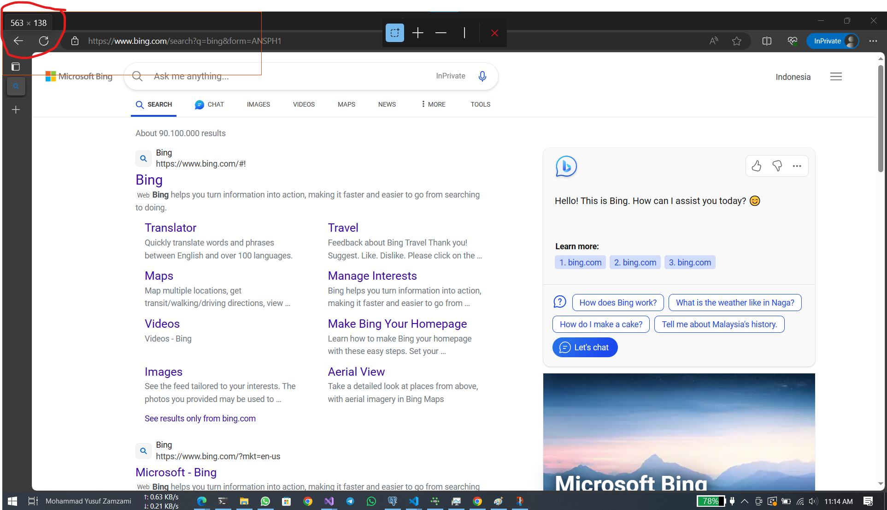

# What this

Automate Microsoft Bing auto search to earn point from Microsoft Reward. for more information about microsoft reward go to [this](https://rewards.bing.com/).

# Requirements

- Python installed on your machine.
- Basic knowledge using `terminal`

# Get Started

## Clone repository

```bash
    git clone https://github.com/zamzami16/BingAutoSearch.git
```

or download this as zip.

## Create Virtual Environment (optional)

I recomend to use virtual environment, if you consider to install package to main environment, skip this section.

```bash
python -m venv venv
venv/scripts/activate
```

## Install Requirements packages

```bash
python -m pip install -r requirements.txt
```

## Running the script

On opened new tab of Microsoft edge, open terminal, and then run this:

```bash
python AutoBingSearch.Py
```

Or you can run using Powershell script on `search.ps1` script. `Note` that if you not use virtual environment, delete the first line of code

```shell
venv/scripts/activate // delete this line
python AutoBingSearch.py
```

and just type on your terminal.

```bash
./search.ps1
```

Minimize your terminal, and wait until the process finished. the estimation time of running this is among 9 minutes.

# Configuring The Pointer Position

if you using screen with `1366 x 768` resolution, i think you don't need configure the pointer point. if you use another screen resolutions, you need configure it.

open `AutoBingSearch.py` files, and then edit this code according to your searchbar point / locations.

```python
pg.moveTo(500, 125) # change with your actual searchbar location
```

To obtain search bar location / poin, see [get searchbar location](#get-search-bar-location)

You can refer this table for configuring the serach bar location:

| Resolution | Scale | Location (x,y) | 
| ----------- | ----------- | ----------- |
| `1366 x 768` | 100% | (500, 125) | 
| `1920 x 1080` | 125% | (650, 185) | 


## Get Search bar Location
- Install [Microsoft Power Toys](https://learn.microsoft.com/en-us/windows/powertoys/install)

- Open your Microsoft Edge
- Activate `Scrren Ruler` from Power Toys by pressing `Windows + Shift + M`
- Measure your search bar location

